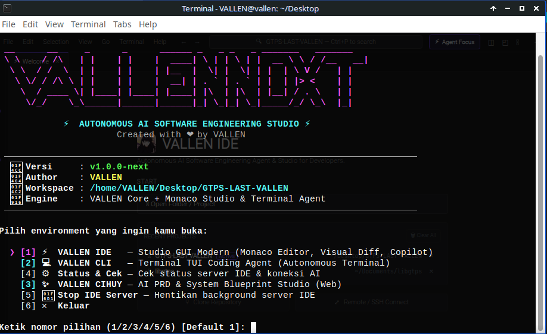

<div align="center">
  
  <h1>⚡ VALLEN NEXT</h1>
  <p><strong>vallennextproject — Autonomous AI Software Engineering Terminal Agent & CLI Suite</strong></p>

  <p>
    <a href="https://github.com/vallenmulia99/vallennextproject"></a>
    <a href="https://python.org"></a>
    <a href="https://github.com/vallenmulia99/vallennextproject/blob/main/LICENSE"></a>
    <a href="https://github.com/vallenmulia99/vallennextproject"></a>
    <a href="https://github.com/vallenmulia99/vallennextproject"></a>
  </p>

  <p>Open-source autonomous AI coding agent for the terminal designed as a lightweight, private, and fully customizable alternative to Claude Code.</p>
</div>

---

## 📌 Keywords & Topics
`autonomous-agent` • `coding-agent` • `claude-code-alternative` • `terminal-agent` • `tui` • `developer-tools` • `vallennext` • `vallencli` • `vallennextproject`

---

## 💡 Apa itu VALLEN NEXT? (vallennext adalah...)

**VALLEN NEXT** (`vallennextproject`) **adalah** ekosistem pengembangan perangkat lunak bertenaga AI (*Autonomous AI Software Engineering Terminal Coding Agent*) open-source yang dirancang sebagai alternatif ringan, privat, dan fleksibel untuk Claude Code dan Cursor di terminal.

Dalam ekosistem ini terdapat dua komponen inti:

- **VALLEN NEXT (`vallennext`) adalah** CLI launcher terpadu dan orkestrator manajemen sistem untuk membuka CLI, cek status, dan konfigurasi token AI.
- **VALLEN CLI (`vallencli`) adalah** terminal coding agent otonom (TUI) berkinerja tinggi untuk automasi rekayasa kode, debugging, pemanggilan sub-agent, dan eksekusi command line mandiri.

---

## 📸 Tampilan Antarmuka (UI Showcase)

### ⚡ Unified Launcher (`vallennext`)
<p align="center">
  
</p>
<p align="center"><em>Unified CLI launcher dengan ASCII banner, diagnosa status sistem, dan pemilih environment yang cepat.</em></p>

### 🖥️ VALLEN CLI — Autonomous Terminal Agent (TUI)
<p align="center">
  
</p>
<p align="center"><em>Agent coding otonom berkecepatan tinggi di dalam terminal dengan subagent tasking, memory compaction, live colored diff card, dan auto-formatter.</em></p>

---

## 🚀 Fitur Unggulan VALLEN CLI & Autonomous Engine

- **20+ Tooling System Terintegrasi**:
  - `read`, `write`, `edit`: Modifikasi baris kode spesifik dengan collision guard & engine **`smart_replace`** yang toleran spasi, tab (`\t`), dan CRLF line-endings.
  - `apply_patch`: Patch multi-file envelope format.
  - `shell`: Eksekusi terminal background dengan buffer protection.
  - `websearch` & `webfetch`: Riset dokumentasi langsung dari internet.
  - `lsp`: Navigasi symbol dan code intelligence.
  - `task`: Subagent delegation untuk eksplorasi codebase besar.
- **Fast Zero-Pygments Diff Viewer**: Kartu tool TUI menampilkan perbandingan diff berwarna tanpa lagging render (`+` hijau, `-` merah, `@@` ungu).
- **Auto-Compaction Memory**: Pangkas log tool lama secara otomatis saat context window mendekati batas model agar sesi tetap hemat token.
- **Self-Healing & Auto-Formatter**: Otomatis menjalankan linter/formatter (`ruff`, `black`, `prettier`, `gofmt`) setelah agent mengedit file.
- **Multi-Provider Support**: Mendukung provider lokal (Ollama) serta provider cloud OpenAI-compatible, 9Router, Anthropic, dan Gemini.
- **Background Daemon Server**: Subcommand `vallencli serve` mandiri untuk integrasi SSE / headless client.

---

## 📦 Kebutuhan Sistem (Prerequisites)

- **Sistem Operasi**: Linux (Ubuntu, Debian, Arch Linux, Fedora, Linux Mint), macOS, atau Windows (via WSL2 / Native Python)
- **Python**: Versi 3.11 atau lebih baru
- **Git**

---

## 🛠️ Panduan Instalasi Cepat

### 1. Clone Repository

```bash
git clone https://github.com/vallenmulia99/vallennextproject.git
cd vallennextproject
```

### 2. Jalankan Installer

```bash
bash install.sh
```

Installer otomatis:
- Menyiapkan virtual environment `.venv`.
- Menginstall seluruh dependensi (`textual`, `rich`, `httpx`, dll).
- Mendaftarkan symlink global `vallennext` dan `vallencli`.

> **Instalasi Manual (Alternatif via Pip):**
> ```bash
> python3 -m venv .venv
> source .venv/bin/activate
> pip install -r requirements.txt
> pip install -e .
> ```

---

## 🎮 Cara Menjalankan

### 🌟 1. Unified Launcher (`vallennext`) — Rekomendasi Utama

Cukup ketik satu perintah di terminal:

```bash
vallennext
```

Perintah ini akan membuka menu interaktif untuk mengelola dan meluncurkan environment:
- `[1] 💻 VALLEN CLI` (Terminal Agent)
- `[2] ⚙️ Status & Cek` (Kesehatan sistem & workspace)
- `[3] 🔑 9Router Token` (Konfigurasi API token)
- `[4] ✕ Keluar`

Perintah langsung:
```bash
vallennext cli             # Langsung buka VALLEN CLI Terminal Agent
vallennext status          # Cek status workspace & koneksi AI
vallennext run "prompt"    # Jalankan perintah prompt headless
vallennext -v              # Cek versi VALLEN NEXT
```

### 2. Perintah Langsung VALLEN CLI

```bash
vallencli                  # Buka VALLEN CLI TUI Agent
vallencli run "buatkan api" # Mode headless CLI
vallencli serve            # Jalankan background daemon server
```

---

## ⌨️ Shortcut Keyboard Penting di VALLEN CLI

| Shortcut | Fungsi |
|---|---|
| `Ctrl + P` | Model picker: Pilih dan ganti model AI aktif |
| `Ctrl + N` | New session: Mulai sesi obrolan baru |
| `Ctrl + S` | Session history: Daftar riwayat percakapan |
| `Ctrl + K` | Command palette / Quick commands |
| `Ctrl + H` | Halt: Batalkan generasi AI yang sedang berjalan |
| `Ctrl + D` | Keluar dari aplikasi VALLEN CLI |
| `Enter` | Kirim pesan |
| `Shift + Enter` | Baris baru (multiline input) |

---

## ⚙️ Konfigurasi Provider & Model AI

Konfigurasi tersimpan pada file `~/.config/vallen/config.toml` atau dapat diatur via perintah `/models` di dalam CLI.

```toml
[general]
theme = "dark"
temperature = 0.7
max_tokens = 8192

[providers]
active = "9router"

[providers.9router]
base_url = "http://127.0.0.1:20128/v1"
api_key = "your-api-key-here"
model = "ag/claude-sonnet-4-6"
enabled = true

[providers.ollama]
base_url = "http://localhost:11434/v1"
api_key = "ollama"
model = "deepseek-r1:14b"
enabled = false
```

---

## ❓ FAQ & Ringkasan Pencarian (SEO Index)

- **Apa itu vallennext / vallennextproject?**  
  `vallennext` (`vallennextproject`) adalah platform autonomous AI software engineering open-source buatan VALLEN (@vallenmulia99) berfokus pada terminal agent TUI (`vallencli`).
- **Apa itu vallencli?**  
  `vallencli` adalah terminal-based coding agent berbasis Python dan Textual TUI yang mampu membaca file, merancang patch, menjalankan pengujian otomatis, dan menyelesaikan bug software engineering secara otonom.

---

## 👤 Author & Full Credits

Project ini dirancang, dibangun, dan dikembangkan secara penuh oleh:

- **Creator & Lead Developer**: **VALLEN** ([@vallenmulia99](https://github.com/vallenmulia99))
- **Official Repository**: [https://github.com/vallenmulia99/vallennextproject](https://github.com/vallenmulia99/vallennextproject)
- **License**: MIT License

---

<div align="center">
  <p><em>Built with passion by VALLEN — Autonomous AI Software Engineering for Everyone.</em></p>
</div>
