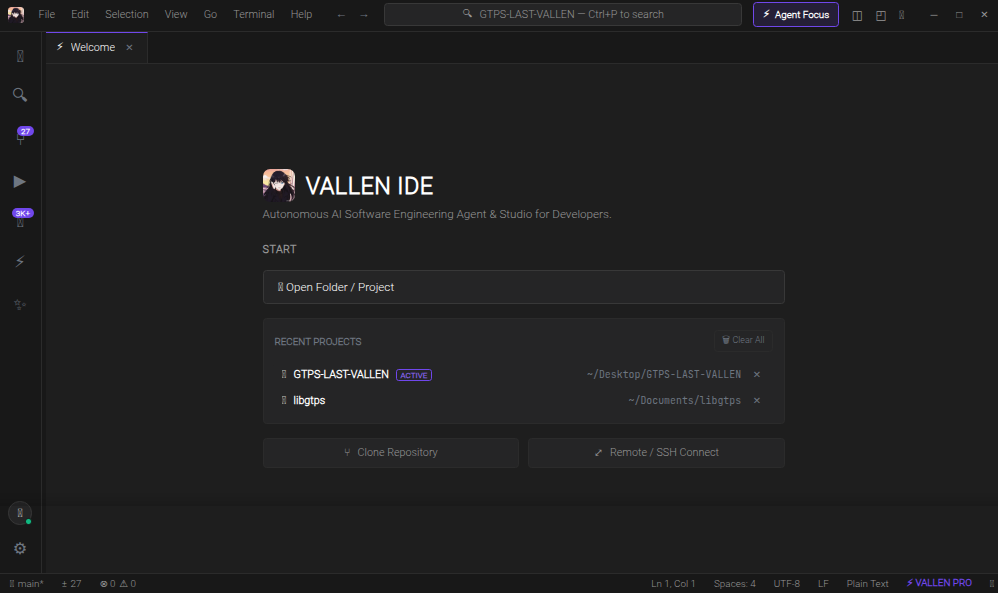
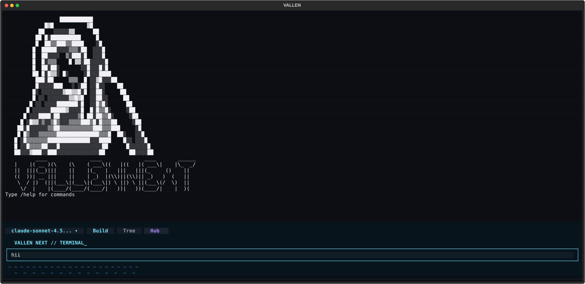

<div align="center">
  
  <h1>⚡ VALLEN NEXT</h1>
  <p><strong>vallennextproject — Autonomous AI Software Engineering Studio & Terminal Agent</strong></p>

  <p>
    <a href="https://github.com/vallenmulia99/vallennextproject"></a>
    <a href="https://python.org"></a>
    <a href="https://github.com/vallenmulia99/vallennextproject/blob/main/LICENSE"></a>
    <a href="https://github.com/vallenmulia99/vallennextproject"></a>
    <a href="https://github.com/vallenmulia99/vallennextproject"></a>
  </p>

  <p>Open-source autonomous AI coding studio and terminal agent designed as a lightweight, private, and fully customizable alternative to Cursor and Claude Code.</p>
</div>

---

## 📌 Keywords & Topics
`ai-code-editor` • `autonomous-agent` • `coding-agent` • `cursor-alternative` • `claude-code-alternative` • `monaco-editor` • `terminal-agent` • `tui` • `developer-tools` • `vallennext` • `vallen-ide` • `vallencli` • `vallennextproject`

---

## 💡 Apa itu VALLEN NEXT? (vallennext adalah...)

**VALLEN NEXT** (`vallennextproject`) **adalah** ekosistem pengembangan perangkat lunak bertenaga AI (*Autonomous AI Software Engineering Studio & Terminal Coding Agent*) open-source yang dirancang sebagai alternatif ringan, privat, dan fleksibel untuk Cursor, Windsurf, dan Claude Code.

Dalam ekosistem ini terdapat dua komponen inti dan satu launcher terintegrasi:

- **VALLEN NEXT (`vallennext`) adalah** CLI launcher terpadu dan orkestrator yang menghubungkan seluruh komponen sistem dengan diagnosa otomatis.
- **VALLEN CLI (`vallencli`) adalah** terminal coding agent otonom (TUI) berkinerja tinggi untuk automasi rekayasa kode, debugging, pemanggilan sub-agent, dan eksekusi command line mandiri.
- **VALLEN IDE (`vallenide` / `vallen-ide`) adalah** modern AI Code Studio berbasis Monaco Editor dengan visual unified diff viewer, live Linux PTY multi-terminal, dan real-time AI copilot reasoning.
- **VALLEN CIHUY (`vallen-cihuy`) adalah** AI PRD & System Blueprint Studio berbasis web untuk perancangan arsitektur dan spesifikasi aplikasi instan.

---

## 📸 Tampilan Antarmuka (UI Showcase)

### 🎨 VALLEN IDE — Modern AI Code Studio & Monaco Editor
<p align="center">
  
</p>
<p align="center"><em>Antarmuka VALLEN IDE dengan Monaco Editor, AI Copilot real-time, Live Linux PTY multi-terminal, side-by-side diff review, dan sinkronisasi file instan.</em></p>

### ⚡ Unified Launcher (`vallennext`)
<p align="center">
  
</p>
<p align="center"><em>Unified CLI launcher dengan ASCII banner, diagnosa status sistem, dan pemilih environment yang cepat.</em></p>

### 🖥️ VALLEN CLI — Autonomous Terminal Agent (TUI)
<p align="center">
  
</p>
<p align="center"><em>Agent coding otonom berkecepatan tinggi di dalam terminal dengan subagent tasking, memory compaction, dan auto-formatter.</em></p>

---

## 🚀 Fitur Unggulan

### 🎨 1. VALLEN IDE (Studio Antarmuka)
- **Monaco Code Editor**: Editor kode standar industri dengan syntax highlighting, minimap, multi-tab, code navigation, dan keyboard shortcuts VS Code.
- **AI Agent Copilot & Live Reasoning**:
  - **Autonomous Multi-Round Execution**: Mampu menjalankan 50 hingga 100 ronde eksekusi tool berkelanjutan tanpa terhenti di tengah jalan.
  - **Quick Continuation Chips**: Tombol 1-klik `⚡ Lanjut (Continue)`, `🔨 Build & Test`, dan `📊 Git Status` untuk interaksi instan tanpa repot mengetik manual.
  - **Real-Time Monaco Live Sync**: Tab editor yang sedang terbuka otomatis memuat kode terbaru saat agent selesai melakukan edit secara instan.
  - Streaming respon real-time dengan blok penalaran terpisah (`💭 Thinking...`).
  - Checklist aktivitas visual (`0/5 tasks`) yang melacak tool agent langkah demi langkah.
  - Tombol **📋 Salin** dan **🔄 Kirim Ulang** di setiap pesan obrolan.
  - Seleksi teks bebas di seluruh elemen chat tanpa batasan CSS.
  - Syntax highlighting otomatis pada blok kode balasan AI menggunakan engine Highlight.js.
- **Side-by-Side Unified Diff Review**: Review perubahan kode sebelum diterapkan dengan diff banner interaktif (`✓ Accept` / `✕ Revert`).
- **Live Linux PTY Multi-Terminal**:
  - Mendukung banyak sesi terminal sekaligus (`1: bash`, `2: bash`, `3: node`, dst.) dengan tombol tambah `+` dan tutup `✕`.
  - Proses terminal berjalan independen di latar belakang tanpa saling mengganggu.
- **Deteksi OS & Penanganan Sudo Otomatis**:
  - AI secara cerdas mendeteksi lingkungan OS (Linux distro, Windows, macOS, user, shell).
  - Ketika sebuah perintah membutuhkan hak akses root (`sudo`), terminal interaktif otomatis terbuka ke layar sehingga pengguna dapat memasukkan password root dengan aman.
- **Visual Git Source Control**: Pantau file modified/untracked, lakukan commit langsung, dan buka perbandingan diff file git hanya dengan 1 klik tombol **Diff**.
- **Command Palette (`Ctrl+Shift+P` & `Ctrl+P`)**:
  - `Ctrl+P` untuk mencari dan membuka file secara cepat.
  - `Ctrl+Shift+P` (atau ketik prefix `>`) untuk mengeksekusi perintah IDE langsung.
- **Recent Projects Management**: Layar Welcome dengan daftar folder project aktif, tombol hapus satuan (`✕`), dan tombol **🗑️ Clear All**.
- **Preferences & Settings Modal (`⚙️`)**: Ganti model AI aktif, ukuran font, jenis font, serta toggle Autopilot langsung lewat antarmuka grafis.

### ⚡ 2. VALLEN CLI & Autonomous Engine
- **20+ Tooling System Terintegrasi**:
  - `read`, `write`, `edit`: Modifikasi baris kode spesifik dengan collision guard & engine **`smart_replace`** yang toleran spasi, tab (`\t`), dan CRLF line-endings.
  - `apply_patch`: Patch multi-file envelope format.
  - `shell`: Eksekusi terminal background dengan buffer protection.
  - `websearch` & `webfetch`: Riset dokumentasi langsung dari internet.
  - `lsp`: Navigasi symbol dan code intelligence.
  - `task`: Subagent delegation untuk eksplorasi codebase besar.
- **Auto-Compaction Memory**: Pangkas log tool lama secara otomatis saat context window mendekati batas model agar sesi tetap hemat token.
- **Self-Healing & Auto-Formatter**: Otomatis menjalankan linter/formatter (`ruff`, `black`, `prettier`, `gofmt`) setelah agent mengedit file.
- **Multi-Provider Support**: Mendukung provider lokal (Ollama) serta provider cloud OpenAI-compatible, 9Router, Anthropic, dan Gemini.

---

## 📦 Kebutuhan Sistem (Prerequisites)

- **Sistem Operasi**: Linux (Ubuntu, Debian, Arch Linux, Fedora, Linux Mint), macOS, atau Windows (via WSL2 / Native Python)
- **Python**: Versi 3.11 atau lebih baru
- **Git**
- **Browser**: Google Chrome, Chromium, atau Firefox (untuk tampilan desktop IDE)

---

## 🛠️ Panduan Instalasi Cepat

### 1. Clone Repository

```bash
git clone https://github.com/vallenmulia99/vallennextproject.git
cd vallennextproject
```

### 2. Jalankan Installer

```bash
bash install.sh
```

Installer otomatis:
- Menyiapkan virtual environment `.venv`.
- Menginstall seluruh dependensi (`fastapi`, `uvicorn`, `textual`, `rich`, `websockets`, `httpx`, dll).
- Mendaftarkan symlink global `vallennext`, `vallencli`, dan `vallen-ide`.
- Memasang shortcut desktop icon di application menu Linux.

> **Instalasi Manual (Alternatif via Pip):**
> ```bash
> python3 -m venv .venv
> source .venv/bin/activate
> pip install -r requirements.txt
> pip install -e .
> ```

---

## 🎮 Cara Menjalankan

### 🌟 1. Unified Launcher (`vallennext`) — Rekomendasi Utama

Cukup ketik satu perintah di terminal:

```bash
vallennext
```

Perintah ini akan membuka menu interaktif dengan ASCII Art dan info sistem untuk memilih mode kerja Anda:
- `[1] ⚡ VALLEN IDE` (Studio GUI)
- `[2] 💻 VALLEN CLI` (Terminal Agent)
- `[3] ⚙️ Status & Cek` (Kesehatan sistem)

Perintah langsung:
```bash
vallennext ide             # Langsung buka VALLEN IDE Studio
vallennext cli             # Langsung buka VALLEN CLI Terminal Agent
vallennext status          # Cek status server IDE & koneksi AI
vallennext stop            # Hentikan background server IDE
vallennext -v              # Cek versi VALLEN NEXT
```

### 2. Perintah Langsung per Aplikasi

```bash
vallen-ide                 # Buka VALLEN IDE Studio
vallencli                  # Buka VALLEN CLI TUI Agent
vallencli run "buatkan api" # Mode headless CLI
```

---

## ⌨️ Shortcut Keyboard Penting

| Shortcut | Fungsi |
|---|---|
| `Ctrl + P` | Quick Open: Cari dan buka file secara instan |
| `Ctrl + Shift + P` | Command Palette: Jalankan perintah IDE |
| `Ctrl + B` | Buka / tutup Sidebar Explorer |
| `Ctrl + \`` | Buka / tutup Panel Terminal bawah |
| `Ctrl + Shift + L` | Fokus kursor langsung ke AI Copilot Chat |
| `Ctrl + Shift + F` | Buka panel Search in Files |
| `Ctrl + Shift + G` | Buka panel Source Control Git |
| `Ctrl + Shift + D` | Quick Run & Debug file aktif di terminal |
| `Shift + Alt + F` | Format dokumen kode aktif |
| `Ctrl + S` | Simpan file aktif |
| `Ctrl + W` | Tutup tab aktif |

---

## ⚙️ Konfigurasi Provider & Model AI

Konfigurasi tersimpan pada file `~/.config/vallen/config.toml` atau dapat diubah melalui menu Settings (`⚙️`) di IDE.

```toml
[general]
theme = "dark"
temperature = 0.7
max_tokens = 8192

[providers]
active = "9router"

[providers.9router]
base_url = "http://127.0.0.1:20128/v1"
api_key = "your-api-key-here"
model = "ag/claude-sonnet-4-6"
enabled = true

[providers.ollama]
base_url = "http://localhost:11434/v1"
api_key = "ollama"
model = "deepseek-r1:14b"
enabled = false
```

---
 
 ## ❓ FAQ & Ringkasan Pencarian (SEO Index)
 
- **Apa itu vallennext / vallennextproject?**  
  `vallennext` (`vallennextproject`) adalah platform AI software engineering open-source buatan VALLEN (@vallenmulia99) yang menggabungkan Monaco IDE web/desktop GUI (`vallenide`) dan terminal agent TUI (`vallencli`).
- **Apa itu vallencli?**  
  `vallencli` adalah terminal-based coding agent berbasis Python dan Textual TUI yang mampu membaca file, merancang patch, menjalankan pengujian otomatis, dan menyelesaikan bug software engineering secara otonom.
- **Apa itu vallenide?**  
  `vallenide` adalah AI code editor modern berbasis web (FastAPI + Monaco Editor + Xterm.js PTY) dengan fitur visual diff, live code synchronization, dan AI copilot multi-round chat.

---

## 👤 Author & Full Credits

Project ini dirancang, dibangun, dan dikembangkan secara penuh oleh:

- **Creator & Lead Developer**: **VALLEN** ([@vallenmulia99](https://github.com/vallenmulia99))
- **Official Repository**: [https://github.com/vallenmulia99/vallennextproject](https://github.com/vallenmulia99/vallennextproject)
- **License**: MIT License

---

<div align="center">
  <p><em>Built with passion by VALLEN — Autonomous AI Software Engineering for Everyone.</em></p>
</div>
